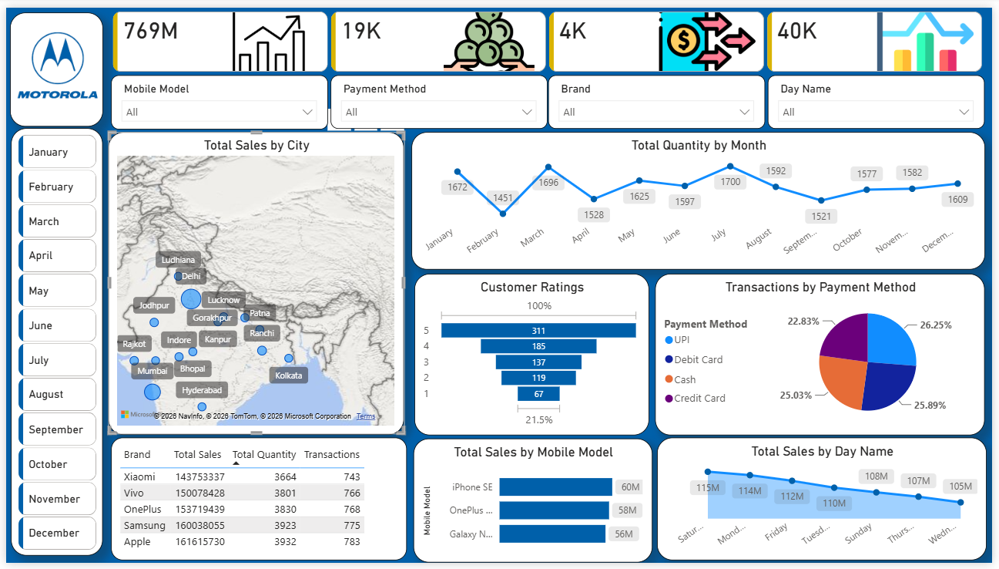

# 📱 Mobile Sales Dashboard — Power BI

## 📊 Project Overview

This project is an interactive **Mobile Sales Dashboard** developed using **Microsoft Power BI**.

The dashboard provides a comprehensive analysis of mobile sales performance across different brands, mobile models, cities, payment methods, customer ratings, months, and days.

The objective of this project is to transform raw mobile sales data into an interactive business intelligence dashboard that helps identify sales trends, customer preferences, and overall business performance.

---

## 🛠️ Tools & Technologies

* **Microsoft Power BI**
* **Power Query**
* **DAX**
* **Microsoft Excel**
* **Data Visualization**

---

## 📂 Dataset

The dataset contains **3,835 mobile sales transactions** with **14 columns**.

### Key Columns

* Transaction ID
* Day
* Month
* Year
* Day Name
* Brand
* Units Sold
* Price Per Unit
* Customer Name
* Customer Age
* City
* Payment Method
* Customer Ratings
* Mobile Model

---

## 📈 Dashboard Features

The dashboard provides insights into:

* Total Sales
* Total Quantity Sold
* Total Transactions
* Total Sales by City
* Total Quantity by Month
* Customer Ratings
* Transactions by Payment Method
* Total Sales by Mobile Model
* Total Sales by Day Name
* Brand-wise Sales
* Brand-wise Quantity
* Brand-wise Transactions

### 🎛️ Interactive Filters

The dashboard includes interactive filters for:

* Mobile Model
* Payment Method
* Brand
* Day Name
* Month

These filters allow users to explore the sales data dynamically and analyze specific segments of the business.

---

## 🖼️ Dashboard Preview



---

## 🔍 Key Business Insights

The dashboard can be used to analyze:

* Monthly sales and quantity trends
* Top-performing mobile brands
* Best-performing mobile models
* City-wise sales performance
* Customer payment preferences
* Customer rating distribution
* Day-wise sales patterns
* Transaction performance across payment methods

---

## 🧹 Data Preparation

The data was prepared and transformed using **Power Query** before creating the dashboard.

The data preparation process included:

* Data cleaning
* Data type validation
* Column transformation
* Date-related field preparation
* Data organization for analysis
* Preparing data for visualization

---

## 📊 Dashboard Components

The dashboard contains multiple interactive visualizations, including:

* KPI Cards
* Line Charts
* Bar Charts
* Funnel Chart
* Pie/Donut Chart
* Map Visualization
* Data Table
* Interactive Slicers

---

## 🎯 Skills Demonstrated

This project demonstrates practical skills in:

* Data Cleaning
* Data Transformation
* Power Query
* DAX
* Data Analysis
* Data Visualization
* Dashboard Development
* Business Intelligence
* Interactive Reporting

---

## 📁 Project Structure

```text
mobile-sales-powerbi-dashboard/
│
├── Mobile_Sales_Dashboard.pbix
├── Mobile_Sales_Data.xlsx
├── Mobile_Sales_Dashboard.png
└── README.md
```

---

## 👨‍💻 About the Author

This project is part of my portfolio, showcasing my **Power BI, data analysis, data visualization, and business intelligence skills** essential for Data Analyst roles.

If you have any questions, feedback, or would like to collaborate, feel free to get in touch!

### Connect With Me

For more content related to **Data Analysis, Power BI, SQL, Python, Excel, and other data-related topics**, feel free to connect with me:

* **GitHub:** [shorya-sharmaa](https://github.com/shorya-sharmaa)
* **LinkedIn:** [Shorya Sharma](https://www.linkedin.com/in/shorya-sharma-da/)
* **Email:** [shoryasharma449@gmail.com](mailto:shoryasharma449@gmail.com)

Thank you for checking out my project. I look forward to connecting and collaborating!

---

⭐ **If you find this project useful, feel free to star the repository!**
